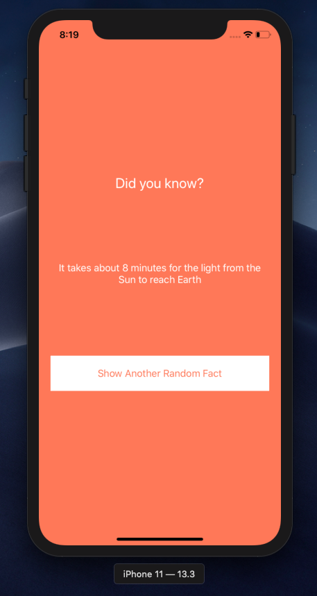
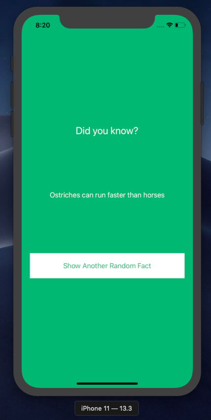
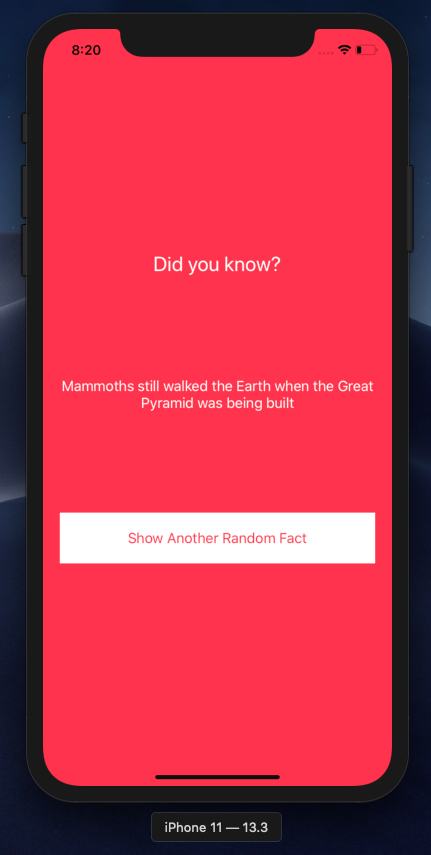

# Random Fact iOS App

This repository contains the source code for a random-fact-gerator app for iOS devices. The application was developed in Swift 5 and employs a repository design pattern by way of "providers".

## Views

